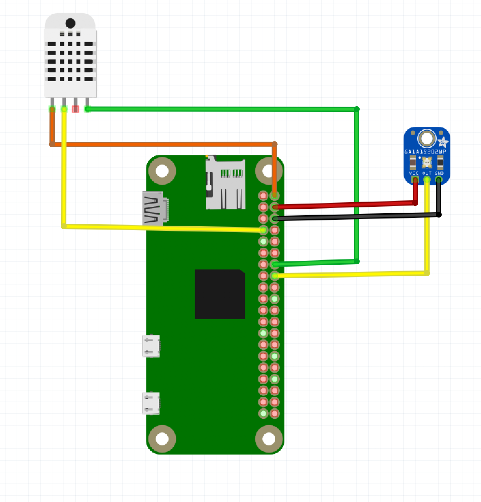
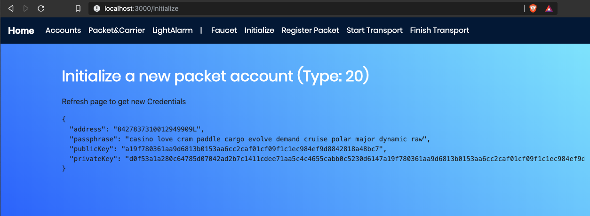

= Workshop: Lisk Transport
Mona Bärenfänger <mona@lightcurve.io>
:toc:
:experimental:

== Motivation

Blockchain can benefit supply chain and transport industries by introducing a new level of data transparency and responsiveness that helps to improve processes and attracts potential clients.
On another hand, applying blockchain to certain supply chains can benefit the end consumer, primary producer, and any other party inbetween, through better insights about how any product came to be.

image::assets/blockchain-supply-chain.jpg[Blockchain Supply Chain]

== Idea

The goal is to create a simple decentralized supply chain tracking system.
The participants of the network can send, transport and receive packets with each other.

For the transportation of the packet, a simple trust system is implemented, that enables the sender to set certain requirements for the carrier of the packet.
The packet as well will be an active participant in the transportation process, as it will track itself with sensors during the transportation.
This is to ensure, that it hasn't been manipulated during the transport.

The carrier will be rewarded upon successful transportation, and penalized if the transportation has failed for some reason.

For convenient usage of the system, a client application will be provided, that visualizes all relevant information about the supply chain tracking system, and that let's users interact with the system by posting custom transactions.

=== General procedure

This diagram shows the general workflow of the supply chain tracking system.
You find detailed descriptions of each step below.

image::transport-uml.svg[Flow chart of Lisk Transport]

==== Initialize packet account

Before registering the packet on the network, the sender needs to create a new account for the packet and store the passphrase on the IoT device inside the packet.
This is necessary, because the packet needs to sign the transactions it sends to the network, in order to communicate with it.

==== Register packet

The packets are registered on the blockchain network by the packet sender.

When creating the `RegisterPacketTransaction`, the sender defines:

* `packetId`: The ID of the packet that has been initialized in the step before.
* `postage`: This amount will be paid to the carrier for the transport of the packet.
* `security`: The security is the amount of tokens that will be locked on the carrier account, when the carrier receives the packet form the sender
* `minTrust`: The minimum amount of trust a carrier needs to have, to transport this packet
* `recipientId`: The ID of the desired recipient of the packet. Only the recipient can send the `FinishTransaction` later, which will finish the transport.

This transaction will:

 * add the above data to the packet account.
 * set the `status` of the packet to `pending`.
 * transfer the postage from the senders' account to the packet account.

==== Start transport

As next step, a carrier would go to the packet senders' address, receive the packet and start the delivery to the recipient.
The carrier needs to sign a transaction `StartTransportTransaction`, that verifies that the packet has been passed on to the carrier.

When creating the `StartTransportTransaction`, the carrier defines:

* `packetID`: The ID of the packet that the carrier is going to transport.

This transaction will:

* lock the specified `security` of the packet in the carriers' account.
This security cannot be accessed by the carrier, unless the transport has been finished successfully.
* add the `carrier` to the packet account.
* set the `status` of the packet from `pending` to `ongoing`.

==== Light alarm

During the transportation of the packet, the packet will track itself with different sensors, to check if it gets manipulated during the travel.
If a manipulation is detected, it will send a self-signed alarm transaction to the network.

This `LightAlarmTransaction` will:

* change the packets' `status` to `alarm`
* Add the current `timestamp` to the list `asset.alarms.light` inside of the packet account.

==== Finish transport

When reaching the recipient of the packet, the carrier passes the packet to the recipient.
The recipient needs to sign the `FinishTransportTransaction`, that verifies that the packet has been passed on to the recipient.

When sending the transaction, the recipient needs to specify:

* `packetID`: The ID of the packet that the recipient received
* `status`: The status of the transport, which has 2 options: `"success"` or `"fail"`

This transaction will:

* If `status="success"`
** Send `postage` to carrier account
** Unlock `security` in carrier account
** Increase `trust` of carrier +1
** Set packet `status` to `success`
* If `status="fail"`
** Send `postage` to sender account
** Add `security` to the sender account, and nullify `lockedSecurity` from the account fo the carrier.
** Decrease `trust` of carrier by -1
** Set packet `status` to `fail`

== Requirements

=== Hardware

==== Hardware to bring yourself
* Laptop with one of the following OS installed:
** Ubuntu 16.04 (LTS) x86_64
** Ubuntu 18.04 (LTS) x86_64
** MacOS 10.13 (High Sierra)
** MacOS 10.14 (Mojave)

==== Hardware provided
* Raspberry Pi Zero W (running a headless Raspbian Buster lite)
* 16GB class 10 SDCard
* A generic analog light sensor based on an LDR
* Jumper cables
* USB -> Micro-USB cable

=== Software Prerequisites
* A code editor like Visual Studio Code
* Node.js (`v10` or higher installed - use `nvm` for easy switching between versions)
* Have `curl` installed
* Have Postgres installed (https://lisk.io/documentation/lisk-sdk/setup.html[Installation guide by Lisk]). Notice, we also talk about creating a lisk user on your system, for MacOS this is not needed.

=== Software

Three different kind of applications need to be developed, to create the decentralized supply chain system:

A node application::
which accepts the application-specific transaction types.
This application needs to be installed on different independent nodes and will setup and maintain the blockchain which is used to store the data about the packets, carrier and users.

A client application::
which is displaying information from the blockchain to the user.
It needs a frontend, which should be listing at least a list of packetIDs, the carrier, sender, recipient, and a status field (`pending | ongoing | alarm | success | fail`).
It should also provide an easy way to create and send the different transaction types to the network.

An IoT application::
which is stored on a microcontroller/raspberry pi. This application will track that the packet is not manipulated during the delivery.
To do this, certain sensors will be connected to it, that track information like light, temperature and/or humidity inside of the packet.
If something unexpected is detected by the IoT app, it will create a transaction object, sign it, and send it to the network.

== Part 1: Track a packet on the blockchain

The goal of this Part is to implement a simple application that tracks sensor measurements on the blockchain.
That means, once the IoT application will be started, it will immediately send an `LightAlarmTransaction` to the network, whenever the sensor detects light.

You will learn here:

* How to implement the `LightAlarmTransaction`
* How to register the new transaction type with the node application
* How to create the iot script, and how to put it on the raspberry pi
* How to use the client app to initialize the packet account and to track the alarm transactions in the network

NOTE: For Part 1 of the workshop, it is not needed to check any status of the packet before sending an alarm transaction.

=== 1.0 Setup

Set up the needed software and hardware and installation of the dependencies.

==== Clone the repo and install the dependencies

The below steps describe how to create the initial files for this tutorial.

["loweralpha"]
. Clone https://github.com/LiskHQ/lisk-sdk-examples/[Lisk-SDK-Examples] repository locally.
+
[source,bash]
----
git clone https://github.com/LiskHQ/lisk-sdk-examples.git
cd lisk-sdk-examples/transport
----
+
The basic file structure looks as following:
+
.Contents of `lisk-sdk-examples/transport`
----
.
├── README.adoc
├── Workshop.adoc
├── client <1>
│   ├── accounts.json
│   ├── app.js
│   ├── package.json
│   ├── scripts
│   └── views
├── iot <2>
│   ├── README.md
│   ├── lisk_rpi_ldr_and_temperature_sensors_wiring.png
│   ├── light_alarm
│   │   ├── package.json
│   │   └── index.js
├── node <3>
│   ├── index.js
│   └── package.json
└── transactions <4>
    ├── finish-transport.js
    ├── light-alarm.js
    ├── register-packet.js
    └── start-transport.js
----
+
<1> Contains the code for the <<software, client application>>
<2> Contains the code for the <<software, IoT application>>
<3> Contains the code for the <<software, node application>>
<4> Contains the <<general-procedure, custom transactions>>
. Navigate inside `transport/transactions` and `transport/node` folders and run `npm install` to install the required dependencies for the node application.
+
[source,bash]
----
cd transport/transactions
npm install
cd ../node
npm install
----
. Setup the database:
.. In case you have experimented before with Lisk, it is possible you have to first drop your database and recreate it with: `dropdb lisk_dev && createdb lisk_dev --owner lisk`.
.. If you set up the Lisk SDK for the first time, run the following 2 commands:
+
[source, bash]
----
sudo -u postgres -i createdb lisk_dev --owner lisk
sudo -u postgres psql -d lisk_dev -c "alter user lisk with password 'password';"
----
. To verify if the setup is correct, try to run the application with
+
[source,bash]
----
node index.js | npx bunyan -o short
----
This command will run the `index.js` file and pipe the outputted logs to our preferred log formatting tool Bunyan.

If everything is running fine, you can stop the node by hitting kbd:[CTRL+C].

==== Prepare the IoT device

[NOTE]
====
These steps are already prepared for you before the workshop.

For reference, see how the sensors can be connected, and the steps to set up the Raspberry Pi below.
====
.Steps to setup the Raspberry Pi
[%collapsible]
====
Wire the sensors::

Preparing the Operating System::
The operating system for the Raspberry needs to be copied from a computer into an SD card for this we recommend using https://www.balena.io/etcher/ (good tutorial in https://medium.com/@ccarnino/backup-raspberry-pi-sd-card-on-macos-the-2019-simple-way-to-clone-1517af972ca5)
+
For preparing the Raspberry for `ssh` and wifi access follow this guide: https://core-electronics.com.au/tutorials/raspberry-pi-zerow-headless-wifi-setup.html
+
As we want to run the Raspberry in headless mode (i.e. no keyboard, mouse and monitor) we need to also enable `ssh` through USB.
To do so follow this guide https://desertbot.io/blog/ssh-into-pi-zero-over-usb
Once all those steps are followed the SD card can be unmounted and inserted into the Raspberry SD card reader.

Installing required libraries for accessing sensor data::
The pins in the Raspberry need some libraries before they can be used for communicating with different sensors.
For installing the required libraries run:
+
* `sudo apt-get install wiringpi`
* `sudo apt-get install pigpio`
* NodeJS can be installed with `nvm`
====

=== 1.1 Implement the LightAlarm transaction

For the very simple version of the packet tracking, only one custom transaction type needs to be implemented: the `LightAlarmTransaction`.
This transaction will be sent by the IoT device inside of the packet, if it detects anomalies with its' connected photoresistor.

The only thing you need to implement in this step yourself is the `validateAsset` function. For more details how to do this, check the <<task-implement-validateasset, explanation below>>.

.Navigate into the `transactions/` directory
[source,bash]
----
cd ../transactions
----

.Contents of `light-alarm.js`
[source,js]
----
const {
    BaseTransaction,
    TransactionError,
} = require('@liskhq/lisk-transactions');

/**
 * Send a light alarm when the packet has been opened.
 * Signed by packet.
 */
class LightAlarmTransaction extends BaseTransaction {                       <1>

    static get TYPE () {
        return 23;                                                          <2>
    }

    static get FEE () {
        return '0';                                                         <3>
    };

    async prepare(store) {
        await store.account.cache([
            {
                address: this.senderId,                                     <4>
            }
        ]);
    }

    validateAsset() {                                                       <5>
        const errors = [];
        /* Write your own logic for validateAsset() here */
        return errors;
    }

    applyAsset(store) { /* Insert the logic for applyAsset() here */ }

    undoAsset(store) {
        const errors = [];
        const packet = store.account.get(this.senderId);

        packet.asset.status = null;
        packet.asset.alarms.light.pop();

        store.account.set(packet.address, packet);
        return errors;
    }
}
module.exports = LightAlarmTransaction;
----

<1> The `LightAlarmTransaction` is extended from the `BaseTransaction` interface.
<2> Static property that defines the transaction type (has to be unique in the network).
<3> The transaction fee. This needs to be paid by the sender when posting the transaction to the network.
It is set to `0` for now, so the packet doesn't need any funds to send an alarm transaction.
<4> Data from the packet account is cached from the databse.
<5> Static checks for presence and correct datatype of `timestamp`, which holds the timestamp of when the alarm was triggered.

==== Quick Overview: Required functions of a custom transaction type

prepare(store)::
The `prepare` function caches relevant data from the database.
This enables the application to work on a consistent data set, while applying the transaction logic.

validateAsset()::
Inside of `validateAsset`, the inputs are validated to ensure the required data is present and that is has the expected data type.
The `validateAsset` function is responsible for only performing static checks.
This means the function is synchronous and cannot use data from the key-value `store` (which holds the data that has been cached in the `prepare` function).
+
Therefore, we can only perform initial checks like validating the presence of the parameter and if the parameter has the correct type.
If validations fails, it shall create a new `TransactionError`, and push it into the `errors` array.
In case the function returns an array that contains errors, the transaction will be discarded.
+
The function for `TransactionError` is exported by `@liskhq/lisk-transactions`.
You can find the constructor https://github.com/LiskHQ/lisk-sdk/blob/development/elements/lisk-transactions/src/errors.ts#L22[here].

applyAsset(store)::
Calls `store.get` to get all of the relevant data.
It applies all of the necessary changes from the received transaction to the affected account(s) by calling `store.set`.

undoAsset(store)::
Inverse of `applyAsset`.
In case the transaction needs to be reverted, due to a network fork.
Undoes all of the changes to the accounts applied by the `applyAsset` step.

A possible solution for implementing the logic of `LightAlarmTransaction` is displayed below.
In our very simple first version of the packet tracking, the transaction will add a new `status` field to the packet account and set its' value to `alarm`.
Additionally, it will create a list `alarms.light` and push the current timestamp to this array.

==== Task: Implement `validateAsset()`

Implement your own logic for the `validateAsset()` function.
It shall validate the timestamp that got sent by the `LightAlarmTransaction`.
In case that an error is found, push a new `TransactionError` into the `errors` array and return it in the function.

TIP: All data, that is sent with the transaction is available through the `this` variable. So, to access the timestamp of the transaction, use `this.timestamp`.

The snippet below describes how to create an `TransactionError` object. Try to add a fitting `TransactionError` to the `errors` list of `validateAsset()`, in case the timestamp is not present, or if it has the wrong format.

NOTE: The expected data type for the timestamp is `number`.

.Example: How to create a `TransactionError` object
[source, js]
----
new TransactionError(
	'Invalid "asset.hello" defined on transaction',
	this.id,
	'.asset.hello',
	this.asset.hello,
	'A string value no longer than 64 characters',
)
----

TIP: In case you need some inspiration, how to implement the `validateAsset()` function, check out the other examples like `hello_world` inside of the `lisk-sdk-examples` repository, or check the https://lisk.io/documentation/lisk-sdk/tutorials/hello-world.html#_3_create_a_new_transaction_type[tutorials] in the Lisk Documentation.

==== Explanation: `applyAsset()`

A possible implementation of `applyAsset` for the `LightAlarmTransaction`. See detailed descriptions of the implementation below.

Copy the snippet and replace the `applyAsset` function in `light-alarm.js` with it, to complete the implementation of the transaction type.

.Implementation of applyAsset()
[source,js]
----
applyAsset(store) {									<1>
    const errors = [];

    const packet = store.account.get(this.senderId);					<2>

    /**
     * Update the Packet account:
     * - set packet status to "alarm"
     * - add current timestamp to light alarms list
     */
    packet.asset.status = 'alarm';							<3>
    packet.asset.alarms = packet.asset.alarms ? packet.asset.alarms : {};
    packet.asset.alarms.light = packet.asset.alarms.light ? packet.asset.alarms.light : [];
    packet.asset.alarms.light.push(this.timestamp);

    store.account.set(packet.address, packet);						<4>

    return errors;									<5>
}
----

<1> Inside of `applyAsset`, we can make use of the cached data from the `prepare` function, which is stored inside of the `store` parameter.
<2> With `store.account.get(ADDRESS)` we now get the account data of the packet account.
We specify `this.senderId` as address, because the light alarm is always signed and sent by the packet itself.
<3> Once we have the data present, it is possible to manipulate it as desired.
<4> When all changes have been made, they are applied to the database by executing `store.account.set(ADDRESS, DATA)`;
<5> Unlike in `validateAsset`, the `store` parameter is present here.
That means, inside of `applyAsset` it is possible to make dynamic checks against the existing data in the database.
As we do not need to this here, an empty `errors` array is returned at the end of the function.

==== Register the transaction with the node application

Now, that we have created the new custom transaction type `LightAlarmTransaction`, it needs to be registered with the node application.
Without this step, the nodes in the network wouldn't recognize the new transaction type and therefore wouldn't accept the transactions.

.Update node/index.js
[source,js]
----
const { Application, genesisBlockDevnet, configDevnet } = require('lisk-sdk');
const LightAlarmTransaction = require('../transactions/light-alarm');           <1>

configDevnet.app.label = 'lisk-transport';

const app = new Application(genesisBlockDevnet, configDevnet);

app.registerTransaction(LightAlarmTransaction);                                 <2>

app
    .run()
    .then(() => app.logger.info('App started...'))
    .catch(error => {
        console.error('Faced error in application', error);
        process.exit(1);
    });
----

<1> Require the custom transaction type.
<2> Register the custom transaction type with the application.

TIP: After the registration of a new transaction type, the node needs to be restarted to apply the changes.

The node application is now ready to accept and process the new transaction type `LightAlarmTransaction`.
As next step, lets create a client application, that helps you explore the data on the blockchain.

=== 1.2 The IoT application

In this step we are going to implement the script that will run on the Raspberry Pi to track if the packet has been manipulated.

==== Connect to the Raspberry Pi

Connect a micro usb cable with the Raspberry and then connect the other end to a computer.

You should be able to log-in through `ssh` by running:

[source, bash]
----
ssh pi@raspberrypi.local
----

If the pi won't respond, press kbd:[CTRL+C] and try the last command again.
If prompted with a warning just hit enter to accept the default (Yes).

Type in the password - by default this is `raspberry`

Your terminal should now be connected to the Raspberry Pi.
On the Raspberry, reate a new folder, which will hold the script for the IoT application.

==== Create the tracking script

[source,bash]
----
mkdir light_alarm							<1>
npm init								<2>
npm i @liskhq/lisk-transactions @liskhq/lisk-api-client @liskhq/lisk-constants rpi-pins <3>
vim light-alarm.js							<4>
vim index.js								<5>
----

<1> Create a folder to hold the tracking script.
<2> Creates the `package.json` file.
<3> Install dependencies.
<4> Insert here the code of the `LightAlarmTransaction`, that we created in the step before and save the file.
<5> Insert the code snippet of the tracking script below.

.Contents of `index.js`
[source,js]
----
const PIN = require("rpi-pins");
const GPIO = new PIN.GPIO();
GPIO.setPin(4, PIN.MODE.INPUT);                                             <1>
const LightAlarmTransaction = require('./light-alarm');
const { EPOCH_TIME } = require('@liskhq/lisk-constants');
const { APIClient } = require('@liskhq/lisk-api-client');

const api = new APIClient(['http://localhost:4000']);                       <2>

const getTimestamp = () => {
    const millisSinceEpoc = Date.now() - Date.parse(EPOCH_TIME);
    const inSeconds = ((millisSinceEpoc) / 1000).toFixed(0);
    return parseInt(inSeconds);
};

const packetCredentials = { /* Insert the credentials of the packet here in step 1.3 */ }

setInterval(() => {                                                          <3>
	let state = GPIO.read(4);
	if(state === 1) {
		//console.log('Packet has been opened! Send lisk transaction!');
        let tx =  new LightAlarmTransaction({
            timestamp: getTimestamp()
        });

        tx.sign(packetCredentials.passphrase);                               <4>

        api.transactions.broadcast(tx.toJSON()).then(res => {
            console.log("++++++++++++++++ API Response +++++++++++++++++");
            console.log(res.data);
            console.log("++++++++++++++++ Transaction Payload +++++++++++++++++");
            console.log(tx.stringify());
            console.log("++++++++++++++++ End Script +++++++++++++++++");
        }).catch(err => {
            console.log(JSON.stringify(err.errors, null, 2));
        });
	} else {
		//console.log('Alles gut');
	}
}, 1000);

----

<1> Rpi-pins uses the WiringPi pin numbering system (check https://pinout.xyz/pinout/pin16_gpio23).
<2> Replace `localhost` with the IP of the node you want to reach for API requests.
<3> Check the status of the sensor in a certain intervall (here: 1 second).
<4> The newly created transaction object signed by the packet.

==== Run the tracking script

To check if the script can read the sensor data, uncomment the `console.log` statements in the trakcing script and start the script by running:

[source, bash]
----
node index.js
----

Now place the sensor in a dark place and then in a light place, and verify the correct logs are shown in the console.

If no light is detected, it should log `Alles gut`, and if light is detected, it will log `Package has been opened! Send lisk transaction!`.

It will also try to send the light alarm transaction in case it detects light.
This will fail, as we didn't provide the passphrase of the packet in the script, which is needed to sign the `LightAlarmTransaction`.

Let's use the client app in the next step 1.3 to initialize a new account for the packet.
We can then store the passphrase on the raspberry pi and explore the send alarm transaction through the client app.

=== 1.3 The client application

First, start the client app.

[NOTE]
====
The complete implementation of the client is prepared for you before the workshop.
In Part 1, we will only make use of the `Initialization` and the `LightAlarm` pages.
====

[source, bash]
----
cd ../client
npm i
node app.js
----

.Navigate to the `Initialize` page to

Every time that you refresh the page, new packet credentials are created and initialized in the network.

Copy the object with the credentials and past it as `packetCredentials` in your <<create-the-tracking-script, tracking script>> on the Raspberry Pi.
The Raspberry has now the power to identify itself with the network, by signing the transaction with it's secret passphrase, before sending it to the network.

To now track the light alarm with the client application, do the following:

. to start the node application, run this inside of the `node` folder:
+
[source, bash]
----
node index.js | npx bunyan -o short
----
. to start the client, run this inside the `client` folder:
+
[source, bash]
----
node app.js
----
. Put the sensor of your raspberry in a dark place.
. Now, start the tracking script on your raspberry pi:
[source, bash]
----
node index.js
----
. Go to the `LightAlarm` page and refresh.
Nothing should be shown on the page, yet.
. Now, shed some light on the sensor, and refresh the page again
. You should see a list of light alarm transaction object, that just got sent by the raspberry pi.

If you see the alarm transactions incoming, you have successfully completed Part 1 of the workshop, congratz! \o/

You are now able to detect a packet manipulation and to save a corresponding record on the blockchain.

== Part 2: A simple supply chain tracking system

=== 2.1 Implement RegisterPacket, StartTransport and FinishTransport transactions

Describe how to implement the missing transaction types. Leave certain parts of the implementation up to the user.

==== a. Register the packet on the blockchain

==== b. Start the Transport

==== d. Finish the Transport

=== 2.2 Extend the client application
Add the following features to the web application from <<part-1-track-a-packet-on-the-blockchain, Part 1: Track a packet on the blockchain>>

* POST RegisterPacket, StartTransport and FinishTransport Transactions
* Explorer of registered Packets and Carriers, displaying `packet.asset` data

=== 2.3 Test it out!

==== Test run on local blockchain

A full test run of the supply chain tracking workflow with the blockchain application

* Make iot script start automatically after boot

==== Connecting multiple nodes

This sections explains how to connect several nodes to your blockchain, and how to exchange the dummydelegates with real ones.

==== Writing unit tests for custom transactions

How to test `undoAsset` functions
