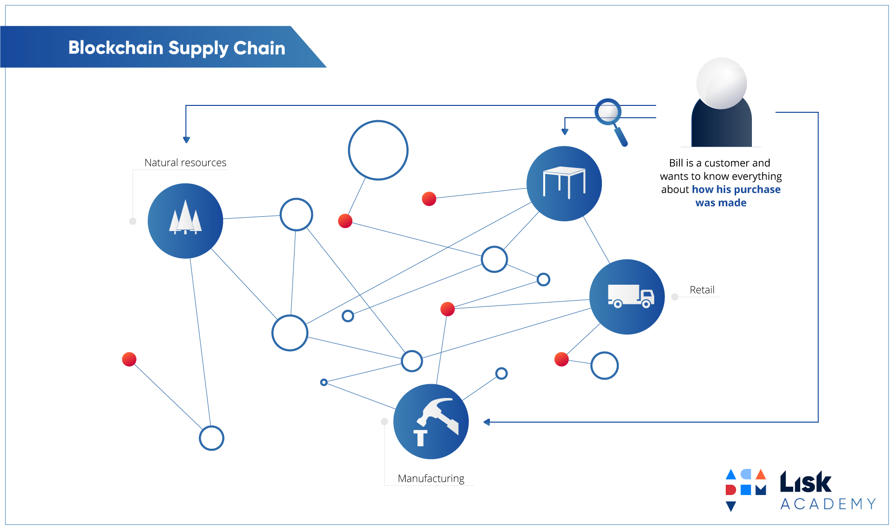
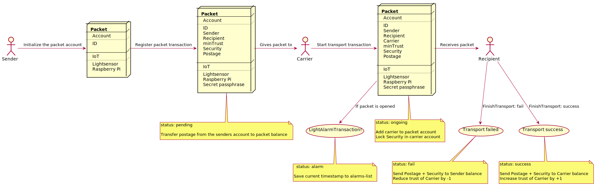

= Workshop: Lisk Transport
Mona Bärenfänger <mona@lightcurve.io>
:toc:
:experimental:

== Motivation

Blockchain can benefit supply chain and transport industries by introducing a new level of data transparency and responsiveness that helps to improve processes and attracts potential clients.
On another hand, applying blockchain to certain supply chains can benefit the end consumer, primary producer, and any other party inbetween, through better insights about how any product came to be.

== Idea

The goal is to create a simple decentralized supply chain tracking system.
The participants of the network can send, transport and receive packets with each other.

For the transportation of the packet, a simple trust system is implemented, that enables the sender to set certain requirements for the carrier of the packet.
The packet as well will be an active participant in the transportation process, as it will track itself with sensors during the transportation.
This is to ensure, that it hasn't been manipulated during the transport.

The carrier will be rewarded upon successful transportation, and penalized if the transportation has failed for some reason.

For convenient usage of the system, a client application will be provided, that visualizes all relevant information about the supply chain tracking system, and that let's users interact with the system by posting custom transactions.

== General procedure

This diagram shows the general workflow of the supply chain tracking system.
You find detailed descriptions of each step below.

=== Initialize packet account

Before registering the packet on the network, the sender needs to create a new account for the packet and store the passphrase on the IoT device inside the packet.
This is necessary, because the packet needs to sign the transactions it sends to the network, in order to communicate with it.

=== Register packet

The packets are registered on the blockchain network by the packet sender.

When creating the `RegisterPacketTransaction`, the sender defines:

* `packetId`: The ID of the packet that has been initialized in the step before.
* `postage`: This amount will be paid to the carrier for the transport of the packet.
* `security`: The security is the amount of tokens that will be locked on the carrier account, when the carrier receives the packet form the sender
* `minTrust`: The minimum amount of trust a carrier needs to have, to transport this packet
* `recipientId`: The ID of the desired recipient of the packet. Only the recipient can send the `FinishTransaction` later, which will finish the transport.

This transaction will:

 * add the above data to the packet account.
 * set the `status` of the packet to `pending`.
 * transfer the postage from the senders' account to the packet account.

=== Start transport

As next step, a carrier would go to the packet senders' address, receive the packet and start the delivery to the recipient.
The carrier needs to sign a transaction `StartTransportTransaction`, that verifies that the packet has been passed on to the carrier.

When creating the `StartTransportTransaction`, the carrier defines:

* `packetID`: The ID of the packet that the carrier is going to transport.

This transaction will:

* lock the specified `security` of the packet in the carriers' account.
This security cannot be accessed by the carrier, unless the transport has been finished successfully.
* add the `carrier` to the packet account.
* set the `status` of the packet from `pending` to `ongoing`.

=== Light alarm

During the transportation of the packet, the packet will track itself with different sensors, to check if it gets manipulated during the travel.
If a manipulation is detected, it will send a self-signed alarm transaction to the network.

This `LightAlarmTransaction` will:

* change the packets' `status` to `alarm`
* Add the current `timestamp` to the list `asset.alarms.light` inside of the packet account.

=== Finish transport

When reaching the recipient of the packet, the carrier passes the packet to the recipient.
The recipient needs to sign the `FinishTransportTransaction`, that verifies that the packet has been passed on to the recipient.

When sending the transaction, the recipient needs to specify:

* `packetID`: The ID of the packet that the recipient received
* `status`: The status of the transport, which has 2 options: `"success"` or `"fail"`

This transaction will:

* If `status="success"`
** Send `postage` to carrier account
** Unlock `security` in carrier account
** Increase `trust` of carrier +1
** Set packet `status` to `success`
* If `status="fail"`
** Send `postage` to sender account
** Add `security` to the sender account, and nullify `lockedSecurity` from the account fo the carrier.
** Decrease `trust` of carrier by -1
** Set packet `status` to `fail`

== Hardware provided
* Raspberry Pi Zero W (running a headless Raspbian Buster lite)
* 16GB class 10 SDCard
* A generic analog light sensor based on an LDR
* Jumper cables
* USB -> Micro-USB cable

NOTE: xref:Workshop1.adoc[Click here to go to the installation guide]
