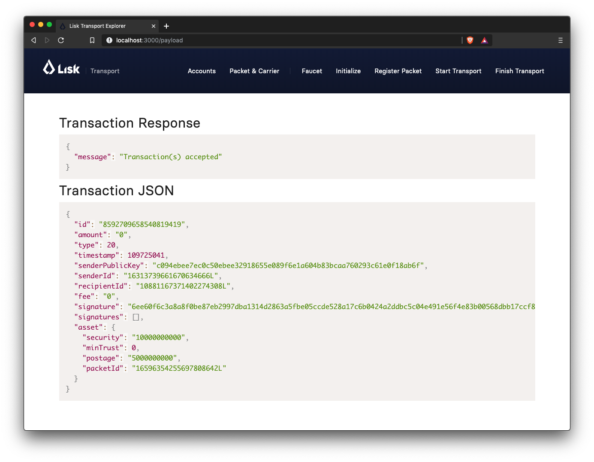
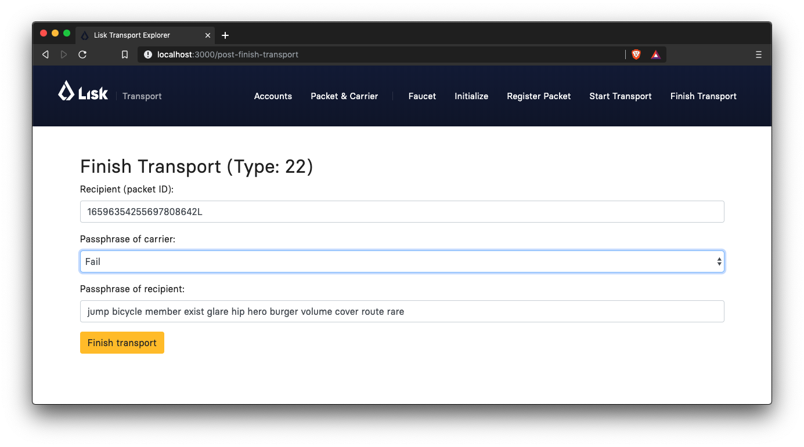

= Part 2: A simple supply chain tracking system
:toc: preamble
:experimental:

The goal of Part 2 is to implement a complete workflow of a very simple version of a supply chain tracking system.

You will learn here how to:

* implement the missing transactions types `RegisterPacket`, `StartTransport` and `FinishTransport`
* cache multiple accounts in the `prepare` step
* implement a simple trust system
* lock funds in an account
* do a first complete test-run of the supply chain tracking system

NOTE: To get a good overview about the general workflow we are going to implement, take a look at the xref:Workshop.adoc#general-procedure[diagram on the Introduction page] of the workshop.

[TIP]
====
"Got more of those... solutions?"::
https://github.com/LiskHQ/lisk-sdk-examples/tree/development/transport/transactions/solutions[Yes we have!], check out the fully working implementation of the other transactions in the `transactions/solutions/` folder.

After completing a task, compare with the solutions, to verify if you completed the task successfully. But be aware, there is not only one valid solution, how to write the code. In step 2.3 we will try out the actual code, to verify it works as expected.
====

== 2.0 Implement RegisterPacket

For the next step in our prototype, we need to implement the `RegisterPacket` transaction.
This transaction will register a packet on the blockchain that is ready to be picked up by a delivery person. The transaction allows the package owner to define a couple of properties:

* `packetId`: The ID of the packet account (registered on Raspberry Pi).
* `postage`: The postage refers to a number of LSK tokens the carrier receives upon successful delivery of the packet. The postage is stored in the packet account's asset field.
* `security`: The security refers to a number of LSK tokens that the carrier should lock as a "security" before he can accept the packet for delivery. Upon successful delivery, the security will be unlocked again to the carriers balance.
* `minTrust`: This minimum trust property has been introduced to keep track of well-behaving/performing carriers. Whenever a carrier successfully delivers a packet, his trust will be increased by one. The package owner can set a minimal trust level for a carrier before he can accept the package for delivery. If a carrier has a lower trust than the minimal required trust level, he cannot accept the package for delivery.
* `recipientId`: This is maybe the most important field as it sets the recipient for the package.

For the `RegisterPacketTransaction` we will guide you through the `undoAsset()` function and let you implement a small snippet of code yourself.

.Contents of `register-packet.js`
[source,js]
----
const {
    BaseTransaction,
    TransactionError,
    utils
} = require('@liskhq/lisk-transactions');

/**
 * Register new package for sender and update package account.
 */
class RegisterPacketTransaction extends BaseTransaction {

    static get TYPE () {
        return 20;
    }

    static get FEE () {
        return '0';
    };

    /* Prepare function stores both sender and packet account in the cache so we can
       modify the accounts during the `applyAsset` and `undoAsset` steps. */
    async prepare(store) {
        await store.account.cache([
            {
                address: this.asset.packetId,
            },
            {
                address: this.senderId,
            }
        ]);
    }

    /* Static checks for presence and correct datatypes of transaction parameters in
       asset field like `minTrust`, `security`, `postage`, etc. */
    validateAsset() {
        const errors = [];
        if (!this.asset.packetId || typeof this.asset.packetId !== 'string') {
            errors.push(
                new TransactionError(
                    'Invalid "asset.packetId" defined on transaction',
                    this.id,
                    '.asset.packetId',
                    this.asset.packetId
                )
            );
        }
        if (!this.asset.postage || typeof this.asset.postage !== 'string') {
			errors.push(
				new TransactionError(
					'Invalid "asset.postage" defined on transaction',
					this.id,
					'.asset.postage',
					this.asset.postage,
					'A string value',
				)
			);
        }
        if (!this.asset.security || typeof this.asset.security !== 'string') {
			errors.push(
				new TransactionError(
					'Invalid "asset.security" defined on transaction',
					this.id,
					'.asset.security',
					this.asset.security,
					'A string value',
				)
			);
        }
        if (typeof this.asset.minTrust !== 'number' || isNaN(parseFloat(this.asset.minTrust)) || !isFinite(this.asset.minTrust)) {
			errors.push(
				new TransactionError(
					'Invalid "asset.minTrust" defined on transaction',
					this.id,
					'.asset.minTrust',
					this.asset.minTrust,
					'A number value',
				)
			);
		}
        return errors;
    }

    applyAsset(store) {
        const errors = [];
        /* Retrieve packet account from key-value store. */
        const packet = store.account.get(this.asset.packetId);
        /* Check if packet account already has a status assigned.
           If it has, this means the package is already registered so we throw an error. */
        if (!packet.asset.status) {
            /* --- Modify sender account --- */
            /**
             * Update the sender account:
             * - Deduct the postage from senders' account balance
             */
            const sender = store.account.get(this.senderId);
            /* Deduct the defined postage from the sender's account balance. */
            const senderBalancePostageDeducted = new utils.BigNum(sender.balance).sub(
                new utils.BigNum(this.asset.postage)
            );
            /* Save the updated sender account with the new balance into the key-value store. */
            const updatedSender = {
                ...sender,
                balance: senderBalancePostageDeducted.toString(),
            };
            store.account.set(sender.address, updatedSender);

             /* --- Modify packet account --- */
            /**
             * Update the packet account:
             * - Add the postage to the packet account balance
             * - Add all important data about the packet inside the asset field:
             *   - recipient: ID of the packet recipient
             *   - sender: ID of the packet sender
             *   - carrier: ID of the packet carrier
             *   - security: Number of tokens the carrier needs to lock during the transport of the packet
             *   - postage: Number of tokens the sender needs to pay for transportation of the packet
             *   - minTrust: Minimal trust that is needed to be carrier for the packet
             *   - status: Status of the transport (pending|ongoing|success|fail)
             */
            /* Add the postage now to the packet's account balance. */
            const packetBalanceWithPostage = new utils.BigNum(packet.balance).add(
                new utils.BigNum(this.asset.postage)
            );

            const updatedPacketAccount = {
                ...packet,
                ...{
                    balance: packetBalanceWithPostage.toString(),
                    asset: {
                        recipient: this.recipientId,
                        sender: this.senderId,
                        security: this.asset.security,
                        postage: this.asset.postage,
                        minTrust: this.asset.minTrust,
                        status: 'pending',
                        carrier: null
                    }
                }
            };
            store.account.set(packet.address, updatedPacketAccount);
        } else {
            errors.push(
                new TransactionError(
                    'packet has already been registered',
                    packet.asset.status
                )
            );
        }
        return errors;
    }

    undoAsset(store) {
        const errors = [];

        /* UndoAsset function tells the blockchain how to rollback changes made in the applyAsset function.
           We restore the original balance for both the sender and package account.
           Also, we reset the `asset` field for the package account to `null` as it didn't hold any data at first.*/
        /* --- Revert sender account --- */                                         <8>
        const sender = store.account.get(this.senderId);
        const senderBalanceWithPostage = new utils.BigNum(sender.balance).add(
            new utils.BigNum(this.asset.postage)
        );
        const updatedSender = {
            ...sender,
            balance: senderBalanceWithPostage.toString()
        };
        store.account.set(sender.address, updatedSender);

        /* --- Revert packet account --- */
        const packet = store.account.get(this.asset.packetId);
        /* something is missing here */
        store.account.set(packet.address, originalPacketAccount);

        return errors;
    }

}

module.exports = RegisterPacketTransaction;
----

=== Task: Complete the implementation of the `undoAsset` function.
You will notice a small part of the logic is missing where we reset the packet account to its original state.

Try to implement the xref:transactions/register-packet.js#L160[missing logic] for `undoAsset()` yourself by reverting the steps of the `applyAsset()` function.

**Important: To verify your implementation of `undoAsset()`, compare it with the xref:transactions/solutions/register-packet.js[solution].**

=== Explanation: `undoAsset(store)`
The `undoAsset` function is responsible for telling the blockchain how to revert changes that have been applied via the `applyAsset` function.
This is very useful in case of a fork where we have to change to a different chain.
In order to accomplish this, we have to roll back blocks and apply new blocks of a new chain.
This means, when rolling back blocks we have to update the account state of the affected accounts.
That's the reason why you should never skip writing logic for the `undoAsset` function.

== 2.1 Start the Transport
For the next step in our prototype, we need to implement the `StartTransport` transaction.
This transaction indicates the start of the transportation as the carrier picks up the package from the sender.

When creating the `StartTransport` transaction, the carrier defines:

* `packetId`: The ID of the packet that the carrier is going to transport.
The `packetId` is not send in the asset field but is assigned to the `recipientId` property of the transaction.

This transaction will:

* Lock the specified `security` of the packet in the carriers' account.
This security cannot be accessed by the carrier, unless the transport has been finished successfully.
* Add the `carrier` to the packet account.
* Set the `status` of the packet from `pending` to `ongoing`.

For the `StartTransportTransaction` we will guide you through the `prepare()` and `undoAsset()` functions and let you implement the locking of the security in the carrier his account.

.Contents of start-transport.js
[source,js]
----
const {
    BaseTransaction,
    TransactionError,
    utils
} = require('@liskhq/lisk-transactions');

class StartTransportTransaction extends BaseTransaction {

    static get TYPE () {
        return 21;
    }

    static get FEE () {
        return '0';
    };

    /* We both cache the `senderId` which is the carrier account and
       the `recipientId` which is the packet account in the `prepare` function. */
    async prepare(store) {
        await store.account.cache([
            {
                address: this.recipientId,
            },
            {
                address: this.senderId,
            }
        ]);
    }

    /* We don't need any static validation as there is no data being sent in the `asset` field. */
    validateAsset() {
        const errors = [];

        return errors;
    }

    applyAsset(store) {
        const errors = [];
        const packet = store.account.get(this.recipientId);
        if (packet.asset.status === "pending"){
            const carrier = store.account.get(this.senderId);
            // If the carrier has the trust to transport the packet
            const carrierTrust = carrier.asset.trust ? carrier.asset.trust : 0;
            const carrierBalance = new utils.BigNum(carrier.balance);
            const packetSecurity = new utils.BigNum(packet.asset.security);
            /* Check if the carrier has the minimal trust required for accepting the package.
               Also, we check if the carrier his balance is larger than the required security
               as we need to lock this security from the carrier's account balance. */
            if (packet.asset.minTrust <= carrierTrust && carrierBalance.gte(packetSecurity)) {
                /**
                 * Update the Carrier account:
                 * - Lock security inside the account
                 * - Remove the security from balance
                 * - initialize carriertrust, if not present already
                 */
                /* Next, we lock the defined security (number of LSK tokens) in the asset field
                   under the property `lockedSecurity` and deducted this security from his `carrierBalance`. */
                const carrierBalanceWithoutSecurity = carrierBalance.sub(packetSecurity);
                const carrierTrust = carrier.asset.trust ? carrier.asset.trust : 0;
                const updatedCarrier = /* Insert the updated carrier account here*/
                store.account.set(carrier.address, updatedCarrier);
                /**
                 * Update the Packet account:
                 * - Set status to "ongoing"
                 * - set carrier to ID of the carrier
                 */
                packet.asset.status = "ongoing";
                packet.asset.carrier = carrier.address;
                store.account.set(packet.address, packet);
            } else {
                errors.push(
                    new TransactionError(
                        'carrier has not enough trust to deliver the packet, or not enough balance to pay the security',
                        packet.asset.minTrust,
                        carrier.asset.trust,
                        packet.asset.security,
                        carrier.balance
                    )
                );
            }
        } else {
            errors.push(
                new TransactionError(
                    'packet status needs to be "pending"',
                    packet.asset.status
                )
            );
        }

        return errors;
    }

    undoAsset(store) {
        const errors = [];
        const packet = store.account.get(this.recipientId);
        const carrier = store.account.get(this.senderId);
        /* --- Revert carrier account --- */
        const carrierBalanceWithSecurity = new utils.BigNum(carrier.balance).add(
            new utils.BigNum(packet.assset.security)
        );
        /* For the `undoAsset` function, we need to revert the steps of `applyAsset` again.
           This means we need to remove the locked balance in the `asset` field and add this
           number again to the `balance` of the carrier's account. */
        const updatedCarrier = {
            ...carrier,
            balance: carrierBalanceWithSecurity.toString()
        };
        store.account.set(carrier.address, updatedCarrier);
        /* --- Revert packet account --- */
        /* For the packet account, we need to undo some items as well.
           First of all, we need to set the `deliveryStatus` again to `pending`.
           The `carrier` value need sto be nullified as well. */
        const updatedData = {
            asset: {
                deliveryStatus: "pending",
                carrier: null
            }
        };
        const newObj = {
            ...packet,
            ...updatedData
        };
        store.account.set(packet.address, newObj);
        return errors;
    }

}

module.exports = StartTransportTransaction;
----

=== Task: Lock Funds
Locking funds is actually very straightforward.
First, you deduct the number of tokens you want to lock from the account's balance.

[source,js]
----
const carrierBalanceWithoutSecurity = carrierBalance.sub(packetSecurity);
----

Next, you store the deducted number of tokens in a custom property in the `asset` field.
This ensures, we can later know how much tokens we had locked as a security.

xref:transactions/start-transport.js#L53[Insert your own code here]:
Create an updated object for the carrier account, that substracts the `security` from the carriers balance, and adds a new property `lockedSecurity` to the `asset` field of the carriers account.
The `lockedSecurity` should equal exactly the amount, that you deducted from the carriers `balance`.

NOTE: To unlock locked tokens remove or nullify the custom property in the `asset` field and add the number of tokens again to the account's `balance`.

**Important: To verify your implementation, compare it with the xref:transactions/solutions/start-transport.js[solution].**

=== Explanation: `prepare()`
The prepare function here is caching both the carrier account through the `senderId` and the packet account through the `recipientId`.

_Why can we cache two accounts at the same time?_
Notice that the cache function accepts an array which allows to pass in multiple query objects. When we pass in an array to the cache function, it will try to find a result for each query object.

It is also possible to pass in just one query object without surrounding array. In this case, only objects that exactly match this query object will be cached.

[source,js]
----
async prepare(store) {
        await store.account.cache([
            {
                address: this.recipientId,
            },
            {
                address: this.senderId,
            }
        ]);
    }
----

You can find a more detailed explanation in the custom transactions deep dive article which you can find on https://lisk.io/blog/tutorial/custom-transactions-statestore-basetransaction-transfer-transaction#6658[our blog]. The link opens the section `B/ Combining Filters`.

== 2.2 Finish the Transport

The last custom transaction type we need to implement is the `FinishTransportTransaction`, which will complete the transport of the packet.

When reaching the recipient of the packet, the carrier passes the packet to the recipient.
The recipient needs to sign the `FinishTransportTransaction`, that verifies that the packet has been passed on to the recipient.

When sending the transaction, the recipient needs to specify:

* `packetID`: The ID of the packet that the recipient received
* `status`: The status of the transport, which has 2 options: `"success"` or `"fail"`

This transaction will:

* If `status="success"`
** Send `postage` to carrier account
** Unlock `security` in carrier account
** Increase `trust` of carrier +1
** Set packet `status` to `success`
* If `status="fail"`
** Send `postage` to sender account
** Add `security` to the sender account, and nullify `lockedSecurity` from the account fo the carrier.
** Decrease `trust` of carrier by -1
** Set packet `status` to `fail`

Click here to see the xref:transactions/finish-transport.js[full code for FinishTransportTransaction]

.Code for `applyAsset()` of `finish-transport.js`
[source, js]
----
applyAsset(store) {
    const errors = [];
    let packet = store.account.get(this.recipientId);
    let carrier = store.account.get(packet.asset.carrier);
    let sender = store.account.get(packet.asset.sender);
    // if the transaction has been signed by the packet recipient
    if (this.asset.senderId === packet.carrier) {
        // if the packet status isn't "ongoing" and not "alarm"
        if (packet.asset.status !==  "ongoing" && packet.asset.status !== "alarm") {
            errors.push(
                new TransactionError(
                    'FinishTransport can only be triggered, if packet status is "ongoing" or "alarm" ',
                    this.id,
                    'ongoing or alarm',
                    this.asset.status
                )
            );
            return errors;
        }
        // if the transport was a SUCCESS
        if (this.asset.status === "success") {
            /**
             * Update the Carrier account:
             * - Unlock security
             * - Add postage & security to balance
             * - Earn 1 trustpoint
             */
            /* Write your own code here*/
            /**
             * Update the Packet account:
             * - Remove postage from balance
             * - Change status to "success"
             */
            /* Write your own code here */
            return errors;
        }
        // if the transport FAILED
        /**
         * Update the Sender account:
         * - Add postage and security to balance
         */
        const senderBalanceWithSecurityAndPostage = new utils.BigNum(sender.balance).add(new utils.BigNum(packet.asset.security)).add(new utils.BigNum(packet.asset.postage));

        sender.balance = senderBalanceWithSecurityAndPostage.toString();

        store.account.set(sender.address, sender);
        /**
         * Update the Carrier account:
         * - Reduce trust by 1
         * - Set lockedSecurity to 0
         */
        carrier.asset.trust = carrier.asset.trust ? --carrier.asset.trust : -1;
        carrier.asset.lockedSecurity = null;

        store.account.set(carrier.address, carrier);
        /**
         * Update the Packet account:
         * - set status to "fail"
         * - Remove postage from balance
         */
        packet.balance = '0';
        packet.asset.status = 'fail';

        store.account.set(packet.address, packet);

        return errors;
    }
    errors.push(
        new TransactionError(
            'FinishTransport transaction needs to be signed by the recipient of the packet',
            this.id,
            '.asset.recipient',
            this.asset.recipient
        )
    );
    return errors;
}
----

==== Explanation: Caching data based on data from the db

Sometimes it might be needed to cache accounts or other data from the database, depending on other data that is stored in the database.

To achieve this:

. cache the data with `store.account.cache`
. save the data as a constant with `store.account.get`
. You can now use the newly created constand to cache the rest of the data, like shown in the code snippet below.

.`prepare()` function of `finish-transport.js`
[source,js]
----
async prepare(store) {
    /**
     * Get packet account
     */
    await store.account.cache([
        {
            address: this.recipientId,
        }
    ]);
    /**
     * Get sender and recipient accounts of the packet
     */
    const pckt = store.account.get(this.recipientId);
    await store.account.cache([
        {
            address: pckt.asset.carrier,
        },
        {
            address: pckt.asset.sender,
        },
    ]);
}
----

=== Task: Implement the logic in `applyAsset()` for a successful transport
xref:transactions/finish-transport.js#L83[Write your own logic or the case of a successful transport of the packet here.]

When the recipient receives the packet from the carrier, the recipient would sign and send the `FinishTransportTransaction`.
If the recipient consideres the transport successfull, the carrier should be rewarded accordngly, and the packet status should be updated to `success`.

TIP: Find more information about what exactly to do in the code comments of `finish-transport.js`

**Important: To verify your implementation of `applyAsset()`, compare it with the xref:transactions/solutions/finish-transport.js[solution].**

== 2.3 Test out the full workflow with the client app

=== Check for status in the `lightAlarmTransaction`

Now that we implemented the whole workflow with different statuses for the packet, we actually only want to send an alarm, if the status of the packet is `ongoing` or `alarm`.

Insert the snippet below in the `applyAsset()` function of xref:transactions/light-alarm.js#L39[light-alarm.js], before the code that applies the changes to the database accounts.

If the status isn't `ongoing` or `alarm` it will create a new `TransactionError`, push it to the `errors` list, and return it.

IMPORTANT: You have to insert this snippet twice: Once in `transaction/light-alarm.js` on your local macine, and in the `light-alarm.js` on your raspberry pi.h

[source,js]
----
const packet = store.account.get(this.senderId);
if (packet.asset.status !== 'ongoing' && packet.asset.status !== 'alarm') {
    errors.push(
        new TransactionError(
            'Transaction invalid because delivery is not "ongoing".',
            this.id,
            'packet.asset.status',
            packet.asset.status,
            `Expected status to be equal to "ongoing" or "alarm"`,
        )
    );

    return errors;
}
----

=== Register all transaction types with the node app

If you haven't done yet, uncomment now all the custom transactions, to register them with the node application.

[source, js]
----
const { Application, genesisBlockDevnet, configDevnet } = require('lisk-sdk');
const RegisterPacketTransaction = require('../transactions/register-packet');
const StartTransportTransaction = require('../transactions/start-transport');
const FinishTransportTransaction = require('../transactions/finish-transport');
const LightAlarmTransaction = require('../transactions/light-alarm');

configDevnet.app.label = 'lisk-transport';
configDevnet.modules.http_api.access.public = true;

const app = new Application(genesisBlockDevnet, configDevnet);
app.registerTransaction(RegisterPacketTransaction);
app.registerTransaction(StartTransportTransaction);
app.registerTransaction(FinishTransportTransaction);
app.registerTransaction(LightAlarmTransaction);

app
    .run()
    .then(() => app.logger.info('App started...'))
    .catch(error => {
        console.error('Faced error in application', error);
        process.exit(1);
    });

----

=== Try it out in the client app

Start or restart the `node`, `client` and `iot` application, like you did in xref:Workshop2.adoc#13-the-client-application[Step 1.3 in Part 1] of the workshop.

Go to http://localhost:3000 to access the client app through your web browser.

[TIP]
====
You find prepared account credentials for sender, recipient and carrier in `client/accounts.json`.

These credentials are already prefilled for you in the different forms in the client app.
====

.The accounts of the different actors in Lisk Transport
[source,json]
----
{
  "carrier": {
    "address": "6795425954908428407L",
    "passphrase": "coach pupil shock error defense outdoor tube love action exist search idea",
    "encryptedPassphrase": "iterations=1&salt=4ba0d3869948e39a7f9a096679674655&cipherText=f0a1f0009ded34c79a0af40f12fcf35071a88de0778abea2a1f07861386a4b5c6b13f308f1ebf1af9098b66ed77cb22fc8bd872fa71ff71f3dbed1194928b7e447cb4089359a8be64093f9c1c8a3dca8&iv=e0f1fb7574873142c672a565&tag=ad56e67c5115e9a211c3907c400b9458&version=1",
    "publicKey": "7b97ac4819515de345570181642d975590154e434f86ece578c91bbfa2e4e1e7",
    "privateKey": "c7723897eaaf4462dc0b914af2b1e4905e42a548866e0ddfb09efdfdd4d2df507b97ac4819515de345570181642d975590154e434f86ece578c91bbfa2e4e1e7"
  },
  "recipient": {
    "name": "delegate_100",
    "address": "10881167371402274308L",
    "passphrase": "jump bicycle member exist glare hip hero burger volume cover route rare",
    "encryptedPassphrase": "iterations=1&salt=7ea547604c978413b57cec9cbbe091c1&cipherText=f337705e4a7987fe83c0aaf3bb45931cbf9a4973201849493612e08f59c87682d68303d9370f9c8e7190ef8d370a4b88b874aa6c052f3ec5111b18078aa91788351126c100fafb&iv=214dfb8da1a51a83bf1fa09d&tag=56ae2bd0357cdeebc8e3166da13a8d50&version=1",
    "publicKey": "904c294899819cce0283d8d351cb10febfa0e9f0acd90a820ec8eb90a7084c37"
  },
  "sender": {
    "address": "16313739661670634666L",
    "passphrase": "wagon stock borrow episode laundry kitten salute link globe zero feed marble"
  }
}
----

==== Initialize a new packet account

Go to http://localhost:3000/initialize and copy the packet credentials https://github.com/LiskHQ/lisk-sdk-examples/blob/development/transport/iot/light_alarm/index.js#L18[in your tracking script] on the Raspberry Pi.

.Create new packet credentials
image:assets/1-initialize.png[Initialize packet account]

==== Register the packet

First, head to the http://localhost:3000/post-register-packet[Register Packet] page and fill out the form to register your packet in the network.

IMPORTANT: Use as packet ID the address of the packet credentials that you created in the previous step.

TIP: Set `minTrust` to `0`, because you don't have any carrier in the system yet, that has more than `0` trustpoints.

.Sender posts the `RegisterPacket` transaction to register the packet on the network
image:assets/2-register.png[register packet]

.Check the `Packet & Carrier` page to see if the packet status is now "pending"
image:assets/3-pending.png[packet pending]

If you open the packet at this point, the light alarm transaction should fail, because the packet has the wrong `status`.
It should display the following error:

[source, js]
----
[
  {
    "message": "Transaction invalid because delivery is not \"ongoing\".",
    "name": "TransactionError",
    "id": "5902807582253136271",
    "dataPath": "packet.asset.status",
    "actual": "pending",
    "expected": "Expected status to be equal to \"ongoing\" or \"alarm\""
  }
]
----

==== Fund the carrier account

Before the transport of the packet starts, we first need to transfer some tokens to the carrier account, which doesn't have any tokens initially.
This is necessary, because the carrier needs to lock the `security` in the carriers account, in order to start the transport.

To do this, go to the http://localhost:3000/faucet[Faucet page] and enter the carrier address(`6795425954908428407L`) and the amount of tokens that shall be transferred to this account.

Just make sure, it's enough so the carrier can afford to lock the `security` of the packet, that was defined in the step before, where you registered the packet in the network.

TIP: You can check on the `Accounts` page, if the carrier received the tokens successfully.

image:assets/4-faucet.png[Fund carrier]

==== Start transport

The carrier needs to post the transaction on the http://localhost:3000/post-start-transport[Start Transport] page, to start the transport.

The only thing the carrier needs to specify here, is the `packetId`.

The transaction will only be accepted, if the carrier has enough `trust` and `security`, for the specified packet.

.Carrier posts the `StartTransport` transaction, and then receives the packet from the sender
image:assets/5-start.png[start transport]

.API response

.Check the `Packet & Carrier` page to see if the packet status has changed to "ongoing"
image:assets/6-ongoing.png[packet account 2]

IMPORTANT: The light alarm will only go off after posting `StartTransport` and before posting `FinishTransport`, because of the status check that we added in <<check-for-status-in-the-lightalarmtransaction, Check for status in the lightAlarmTransaction>>

image:assets/7-alarm.png[packet alarm]

==== Finish transport

When the carrier passes the packet to the recipient, the recipient will sign the final http://localhost:3000/post-finish-transport[FinishTransport] transaction, which will complete the transport of the packet.

The only thing the recipient needs to specify here are the `packetId` and the `status`, which can be `fail` or `success`.

To help with the decision of the final status, the recipient can inspect the packet after receiving it.
But that's not all!
Because of the IoT device inside the packet, the recipient can also check in the client app, if the packet triggered any alarm.

NOTE: In case the recipient doesn't receive the packet after a reasonable amount of time, the recipient can and should send the `FinishTransport` transaction, too (most likely with `status=fail`).

.Recipient posts the `FinishTransport` transaction, once he*she received the packet from the carrier

Decide yourself if the transport is successful or not.
Verify the expected changes in the accounts on the `Packet&Carrier` page.

.Transport fail
image:assets/9-fail.png[finish transport]

.API response
image:assets/92-success.png[finish transport]

With all of the above steps completed, you have a very simple, but fully working proof of concept of a decentralised supply chain tracking system running on your machine.

IMPORTANT: Time to celebrate! \o/

TIP: Move on to the next section to find additional explanations and possible next steps.

== 2.4 Next steps (optional)

=== Make it portable

Currently the packet is not really portable, because it is connected via USB to your machine in order to get power.

To make it portable, all you need is a portable power source, like a battery, that provides the Raspberry Pi with enough power to track the packet for at least a few hours.

The second thing that needs to be done is making the tracking script start automatically after the boot process of the Pi.

`pm2` provides an easy way to let your script start automatically after boot.
On your Raspberry Pi, install `pm2` globally:

[source, bash]
----
npm install pm2 -g
pm2 startup
----

This should print a fitting command for you in the terminal.
Copy it and paste it in the temrinal again to complete the setup of the `pm2` startup script.

Start your tracking script with `pm2`:

.Run this inside the `light_alarm` folder on the Raspberry Pi
[source, bash]
----
pm2 start --name light-alarm index.js
----

.Add the tracking script to the list of processes, that will be started autmatically when the raspberry pi is started.
[source, bash]
----
pm2 save
----

Now log out from your Raspberry Pi, disconnect it from your machine, and connect it to a portable energy source, like a power bank.
After 1-2 minutes of booting, the tracking script will start running and it will check the light sensor every second.

=== Add more sensors

Connect the Temp/Humidity sensor to your Raspberry Pi and implement a `TemperatureAlarm` or `HumidityAlarm` analog to the `LightAlarm` transaction type.

=== Connect more nodes

Connect several nodes to your blockchain network

=== Replace dummy delegates with real ones

Exchange the dummy delegates with real delegates.

=== Write unit tests for custom transactions

How to test `undoAsset` functions
