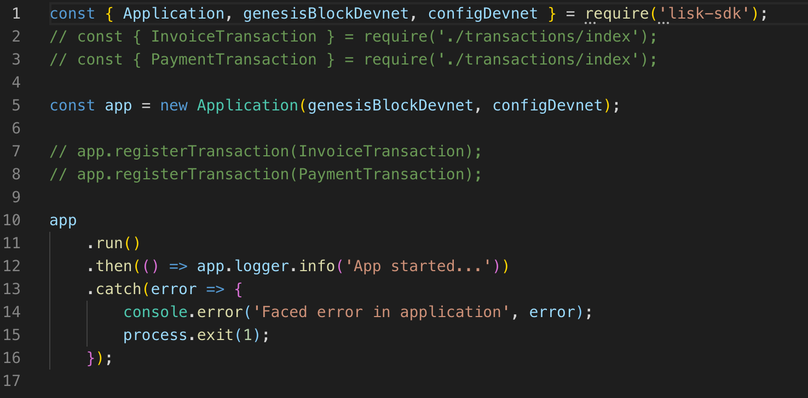

# Workshop: Knowledge Sharing on Custom Transactions

This workshop will guide you through learning about custom transactions with a step-by-step approach. The workshop demands you to actively participate in order to get familiar with custom transactions. This workshop focuses on the LiskBills proof of concept which showcases the potential of the Lisk Alpha SDK, in particular developing custom transactions.

**Make sure to read the prerequisites and execute each step of the setup.**

## Prerequisites
- Code editor like _Visual Studio Code_
- Node.js (v10 or higher installed - use [nvm](https://github.com/nvm-sh/nvm#install--update-script) for easy switching between versions)
- Have `curl` or `Postman` installed
- Have Postgres **system-wide** installed, **don't install via Docker**! ([Installation guide by Lisk](https://lisk.io/documentation/lisk-core/setup/source#b-postgres-system-wide))

## Setup
1. Clone [Lisk-SDK-Examples](https://github.com/LiskHQ/lisk-sdk-examples) repository locally.<br><br>

2. Checkout branch `development` (by default active branch).<br><br>

2. Navigate inside `/workshop` folder and run `npm install` to install the required dependencies for the workshop.<br><br>

3. Next, the `/workshop/transactions` folder is considered a separate module which holds the code for the transaction types. Again, we have to execute `npm install` inside this folder to install the remaining dependencies. Notice in both `package.json` files, there is only one dependency we use: `lisk-sdk: 2.3.5`.<br><br>

4. To verify the setup is correct, try to run the application with `npm start`. The `npm start` command will run the `index.js` file and pipe the outputted logs to our preferred log formatting tool Bunyan (wraps: `node index.js | npx bunyan -o short`). If everything is running fine, you can go to the next section.<br><br>_In case you have experimented before with Lisk, it is possible you have to first drop your database and recreate it with:_ `dropdb lisk_dev && createdb lisk_dev`.

## Concept: LiskBills
Imagine **Alice (Freelancer)** and **Bob (Client)**. Bob is looking for a new logo for his website and decides to consult a freelancer. While looking for a good designer, he comes across Alice who offers some spectacular designs in her portfolio. Bob is so excited he decides to immediately employ Alice’s skillset.

A few days go by, and Alice returns the promised logo together with an invoice. However, Bob is a big fan of blockchain technology as it helps to ease the settlement process. It often happens parties disagree about the agreed price, product, or even shipping terms. Bob, therefore, believes blockchain can help with recording all this information right from the beginning, so no disputes can occur and human error can be eliminated. The blockchain should act as proof for the invoice.

For the above reason, Bob asks Alice to create the invoice via a Lisk custom transaction (InvoiceTransaction). Next, he creates another custom transaction to send the payment to Alice (PaymentTransaction).

**In summary:** We will explore the above two custom transaction types that we used for LiskBills. The idea is that a freelancer can send an `invoice_transaction` to send an invoice to a client. Next, the client can pay for the invoice by sending a `payment_transaction` to the freelancer.

## Transaction 1: Invoice Transaction
The invoice transaction accepts three parameters (send by the freelancer to the client):
```json
{
    "client": "<string: company name>",
    "requestedAmount": "<string: amount of invoice to be paid>",
    "description": "<string: any description of the delivered service>",
}
```

### Implementation Details
- Validates all three parameters
- Keeps track of the number of invoices the freelancer has sent using a property `invoiceCount` in the asset field of the freelancer his account (type: `number`).
- Keeps track of the IDs of the sent invoices using a property `invoicesSent` in the asset field of the freelancer his account (type: `Array`).

This means that we will be only modifying the sender (freelancer) his account.

### Exploring Invoice Transaction
Now, let's get technical. Open the file at `./transactions/invoice_transaction.js`. For this transaction, most code is ready so we can learn how to write a custom transaction. After this, you'll be writing the payment transaction yourself.

### Extending BaseTransaction
Ok, let's talk briefly about the BaseTransaction. The next thing to notice, we are extending the `InvoiceTransaction` from the [BaseTransaction class](https://github.com/LiskHQ/lisk-sdk/blob/development/elements/lisk-transactions/src/base_transaction.ts). This gives us the ability to write logic for `prepare()`, `validateAsset()`, `TYPE`, `FEE`, `applyAsset()`, and `undoAsset()`.

Let's explore the different functions and their implementations in the `invoice_transaction.js` file. Open the file so you can follow along with the code.

#### Getter for TYPE
Static function that returns **{number}**. This is the type identifier for the transaction. We use this number to uniquely register our new custom transaction in our blockchain network. This means that we can't register transactions with the same transaction TYPE.

**Important: The Lisk Protocol reserves transaction [types 0 - 4](https://lisk.io/documentation/lisk-protocol/transactions) and Lisk Core reserves transaction types 5 - 7.**

#### Getter for FEE
Static function that returns **{string}**. The fee must be paid when sending this transaction to the blockchain network. We are converting a fee from LSK to Beddows which is the lowest denominal in the Lisk ecosystem: `10 ** 8 = 1 LSK (100000000)`.

_Note: It is possible to use a zero fee._

#### prepare()
The prepare function is used to cache data from the database in a key-value store. This data can later be accessed in the `applyAsset` or `undoAsset` functions to update the state of an account.

As we will be only modifying the sender (freelancer) his account, we just need to cache this account in the key-value store. At the moment, we are implicitly caching the account by calling the implementation in the BaseTransaction class through `super`.

However, this is a bad practice as the implementation might change inside the `BaseTransaction`. Therefore, we want to open the `BaseTransaction` to copy the code that caches the sender account.

**Task 1: Go to [BaseTransaction class](https://github.com/LiskHQ/lisk-sdk/blob/development/elements/lisk-transactions/src/base_transaction.ts#L400-L404) and copy the highlighted implementation of the `prepare()` function and paste it in the `prepare()` function for InvoiceTransaction replacing the `super` call.**

_The solution for each step can be found in the section `Solution: Invoice Transaction`._

Notice, the `prepare` function looks for the account using the `address` filter. In order to get a better understanding of filters, complete task 2 below.

**Task 2: Read about how to use [storage entities](https://github.com/LiskHQ/lisk-sdk/blob/development/framework/src/components/storage/README.md#how-to-use-storage-entities) and examine the examples. Next, read the section about [filters](https://github.com/LiskHQ/lisk-sdk/blob/development/framework/src/components/storage/README.md#filters).**

#### ValidateAsset()
The `validateAsset` function is responsible for only performing static checks. This means the function is synchronous and cannot use data from the key-value store (which holds the cached sender account). Therefore, we can only perform initial checks like validating the presence of the parameter and if the parameter has the correct type. Any other validation logic can be applied as long it does not have to await a promise.

As a best practice, we want to define an empty `errors` array which we return at the end of the function.
Next up, we perform validation for each property in the asset field (client, requestedAmount, and description).

In case we find an error, we push a new `TransactionError` into the array. The errors array is returned at the end of the function. In case the function returns an array that contains errors, the transaction will be discarded.

To go deeper into the `TransactionError`, the function is exported by `@liskhq/lisk-transactions`. You can find the constructor [here](https://github.com/LiskHQ/lisk-sdk/blob/development/elements/lisk-transactions/src/errors.ts#L22).

```javascript
public constructor(
    message: string = '',
    id: string = '',
    dataPath: string = '',
    actual?: string | number,
    expected?: string | number,
) { ... }
```

Usage in the `InvoiceTransaction`: 
```javascript
new TransactionError(
    'Invalid "asset.client" defined on transaction',
    this.id,
    '.asset.client',
    this.asset.client,
    'A string value',
)
```

#### applyAsset()
Finally, we have arrived to the hard work! Let's dissect the `applyAsset` function line by line.

```javascript
applyAsset(store) {
    const sender = store.account.get(this.senderId);

    // Save invoice count and IDs
    sender.asset.invoiceCount = sender.asset.invoiceCount === undefined ? 1 : ++sender.asset.invoiceCount;
    sender.asset.invoicesSent = sender.asset.invoicesSent === undefined ? [this.id] : [...sender.asset.invoicesSent, this.id];
    store.account.set(sender.address, sender);
    return [];
}
```

First, we retrieve the data from the store. The store exposes two key-value stores: `account` and `transaction`.
The `account` store is read-write, `transaction` store is read-only. This means we can modify data for the account object but transaction data cannot be changed.

**Extra**: If you wonder where the `this.senderId` comes from, every transaction its properties are accessible through the `this` keyword. So is `this.asset` also accessible.

**Task 3: Read about the exposed methods by both stores [at the section `B/ Retrieving Data`](https://blog.lisk.io/a-deep-dive-into-custom-transactions-statestore-basetransaction-and-transfertransaction-df769493ccbc).**

Now you have read about the exposed methods, you know that the `account` store exposes a `get` function that returns a deep clone of the account object. This means we can freely change properties on the object without having to care about references to the original object.

Next, we have to code with the idea that this can be the first custom transaction. This means that the properties like `invoiceCount` and `invoicesSent` do not yet exist in the asset field of the sender account. Therefore, we have this logic to check if the property is undefined or not. If it is, we set the `invoiceCount` to 1, otherwise, we increase the count by one.

The same applies to `invoicesSent`. If the property doesn't exist, we create a new array with the id of the transaction. Otherwise, we append the id to the existing array.

```javascript
sender.asset.invoiceCount = sender.asset.invoiceCount === undefined ? 1 : ++sender.asset.invoiceCount;
sender.asset.invoicesSent = sender.asset.invoicesSent === undefined ? [this.id] : [...sender.asset.invoicesSent, this.id;
```

Next, we update the object in the key-value store `store.account.set(sender.address, sender)`. We can only save a modified account object by using the address of the account followed by the updated sender object.

```
Note: Under the hood, the cache method retrieves data from the database
and stores this data in an in-memory key-value store inside the Lisk application.

When updating an account with the set method, it doesn't mean we are changing the account in the database yet.

Only when the transaction gets into a block and no errors occur,
the transaction will be applied and the changes we made in the key-value store will be saved to the database.
```

Notice that we return an empty array at the end of the function. The same idea applies here as well. As the `validateAsset()` function does only allow for static checks, more advanced checks that require data from the store can be performed in the `applyAsset()` function. In case of an error, we put the error in an array and return this array. However, for the `invoiceTransaction`, we do not require additional validation steps, so we decided to simply return an empty array.

#### undoAsset()
Now, it's your turn. Your task is to write the reversed logic of the `applyAsset()` function. The `undoAsset()` function is used to roll back changes that were done by the `applyAsset()` function.

**Use case:** At this moment, the function is called when a fork occurs and we want to switch to a different chain. In that case, we have to undo transactions and we need to know how to undo a transaction for each specific transaction type. That's why we have to define custom undo logic for this custom transaction.

**Task 4: Complete the code for Undo() function:**
Here's the flow of actions for the `undo()` function:
1. Retrieve sender account
2. Reduce `invoiceCount` (**Tip**: remember the `undefined` state when it's the first transaction)
3. Remove id from `invoicesSent` array (**Tip**: use splice - Again, remember the `undefined` case)
4. Return errors

_The solution can be found in the `Solution: Invoice Transaction` section._

### Testing the InvoiceTransaction
To test the `InvoiceTransaction`, we have to register the custom transaction to our blockchain in the `index.js` file in the root of the `/workshop` folder.

You'll find code that is commented out. Uncomment the line for importing the `InvoiceTransaction` and uncomment the line of code that registers the custom transaction to the application.



Next, verify if everything is fine by starting the application with `npm start`. In order to verify if our custom invoice transaction works, we should send an invoice transaction. 

#### Generate Invoice Transaction
The `/workshop/generator/invoice.js` file contains a generator that uses a genesis account with sufficient funds and creates an InvoiceTransaction JSON object (Run `node generator/invoice.js`).

**Task 5: Quickly explore the generator code at `/workshop/generator/invoice.js`. Next, run the generator and copy the printed JSON transaction payload from your terminal. We will use this payload in the next step to send to the exposed API of our blockchain.**

To speed things up, you'll find a formatted JSON transaction object down below:

<details>
    <summary>Invoice Tx JSON:</summary>

    { 
        "id": "6068542855269194380",
        "amount": "0",
        "type": 13,
        "timestamp": 106087382,
        "senderPublicKey":
        "c094ebee7ec0c50ebee32918655e089f6e1a604b83bcaa760293c61e0f18ab6f",
        "senderId": "16313739661670634666L",
        "recipientId": "8273455169423958419L",
        "fee": "100000000",
        "signature":
            "4855b3b65484b94e6653601dfcafe1205a77fd16431c9e034460015ae9c09e1bd81be7877c9b9cca68b63979a3483589f79b2619093f3266e46515f16382cd02",
        "signatures": [],
        "asset":
        { "client": "Michiel GmbH",
            "requestedAmount": "1050000000",
            "description": "Workshop delivered" }
    }
</details>

#### Broadcast Invoice Transaction
Now, when the blockchain application is running (`npm start`), let's send the above JSON payload to the transactions endpoint with a POST request: `http://localhost:4000/api/transactions`. You can use Postman or `curl`:

```bash
curl -XPOST -H "Content-type: application/json" -d '{ 
    "id": "6068542855269194380",
    "amount": "0",
    "type": 13,
    "timestamp": 106087382,
    "senderPublicKey":
    "c094ebee7ec0c50ebee32918655e089f6e1a604b83bcaa760293c61e0f18ab6f",
    "senderId": "16313739661670634666L",
    "recipientId": "8273455169423958419L",
    "fee": "100000000",
    "signature":
        "4855b3b65484b94e6653601dfcafe1205a77fd16431c9e034460015ae9c09e1bd81be7877c9b9cca68b63979a3483589f79b2619093f3266e46515f16382cd02",
    "signatures": [],
    "asset":
    { "client": "Michiel GmbH",
        "requestedAmount": "1050000000",
        "description": "Workshop delivered" }
}' http://localhost:4000/api/transactions
```

You should receive the following success result:

```json
{
    "meta": {
        "status": true
    },
    "data": {
        "message": "Transaction(s) accepted"
    },
    "links": {}
}
```

If you want to be absolutely sure the transaction has been accepted and included in a block, query the following endpoint with the right transaction type (13) as an argument (GET request): `curl "http://localhost:4000/api/transactions?type=13"`.

The query should return an array of type 13 transactions. If this is your first transaction, the array should only contain one type 13 transaction.

### Solution: Invoice Transaction

<details>
    <summary>Prepare() function:</summary>

    async prepare(store) {
        await store.account.cache([
			{
				address: this.senderId,
			},
		]);
    }
</details>

<details>
    <summary>Undo() function:</summary>

    undoAsset(store) {
        const sender = store.account.get(this.senderId);

		// Rollback invoice count and IDs
		sender.asset.invoiceCount = sender.asset.invoiceCount === 1 ? undefined : --sender.asset.invoiceCount;
		sender.asset.invoicesSent = sender.asset.invoicesSent.length === 1 ? undefined : sender.asset.invoicesSent.splice(
			sender.asset.invoicesSent.indexOf(this.id),
			1,
		);
		store.account.set(sender.address, sender);
        return [];
    }
</details>

## Nuggets of Knowledge about Custom Transactions
Before we continue with the `PaymentTransaction`, let's first explore some important concepts related to custom transactions.

### Why can we access this.id or this.amount?
**Task 6: Read section `7. Why can I use` in this [article](https://blog.lisk.io/a-deep-dive-into-custom-transactions-statestore-basetransaction-and-transfertransaction-df769493ccbc) to learn why we can access these properties.**

The full constructor logic for this can be found on [Github](https://github.com/LiskHQ/lisk-sdk/blob/development/elements/lisk-transactions/src/base_transaction.ts#L142).


### Which filters can we use for the Store?
**Task 7: Read up about which filters we can use and why we can access them. You can find it at section `A/ Filters Usage` in [this article](https://blog.lisk.io/a-deep-dive-into-custom-transactions-statestore-basetransaction-and-transfertransaction-df769493ccbc).**

### Should we extend from BaseTransaction or TransferTransaction?
**Task 8: To answer this question, read the following section `1. Should I extend from` in [this article](https://blog.lisk.io/a-deep-dive-into-custom-transactions-statestore-basetransaction-and-transfertransaction-df769493ccbc).**

## Transaction 2: Payment Transaction
The payment transaction accepts one parameter in the `asset.data` field (sent by the client to the freelancer):
```json
{
    "asset": {
        "data": "<string: invoice ID>"
    }
}
```

### Implementation Details
- Validate if invoice ID exists and if the client is sending the required balance to the freelancer (Tip: dynamic)
- Make sure the tokens are sent to the right account

### Exploring Payment Transaction
If you haven't installed the dependencies inside the `./transactions` folder yet, navigate in your terminal to the `./transactions` folder. Run `npm install` to again install the required dependencies as we treat the `/transactions` folder as a separate module.

Now, let's get technical. Open the file at `./transactions/payment_transaction.js`. For this transaction type (14), most code needs to be written. Good luck!

### Exploring Payment Transaction
The idea for the `PaymentTransaction` is that you write the logic yourself based on the requirements and tips I give to you. The payment transaction will extend from the `TransferTransaction` although we do not recommend this (it simplifies things).

The idea for this transaction is that it will accept only one value that represents the ID of the invoice transaction the client wants to pay for. This invoice ID will be sent in an asset field that contains a data field (as the `TransferTransaction` requires this).

```
"asset": {
    "data": "14582705636451260901",
}
```

**Note:** For each step, the solution can be found in the section below called `Solution: Payment Transaction`.

#### Steps To Be Implemented
1. Replace the `super` cache call with the [actual implementation in the TransferTransaction class](https://github.com/LiskHQ/lisk-sdk/blob/development/elements/lisk-transactions/src/0_transfer_transaction.ts#L69). 

Small task: Read up on combining AND and OR filters, this is exactly what happens in the `prepare()` function of the `TransferTransaction` class. You can find the info at section `B/ Combining Filters` in [this article](https://blog.lisk.io/a-deep-dive-into-custom-transactions-statestore-basetransaction-and-transfertransaction-df769493ccbc)<br><br>

2. Besides that, we also want to cache the invoice transaction using the `this.asset.data` field which contains the invoice ID. Make use of the exposed `transaction` store.<br><br>

3. Find a transaction in the `transaction` store where the `id` matches the id in `this.asset.data`.<br><br>

4. If you've found a transaction, validate if the amount for this transaction is at least equal to (or greater than) the `requestedAmount` from the `InvoiceTransaction`. If you didn't find a transaction, push a `TransactionError` in the `errors` array using the interface we saw earlier in the workshop. **Tip: The `applyAsset` function in our PaymentTransaction holds some basic structure for this check.**<br><br>

To complete things, we should throw an error if the `recipientId` differs from the `senderId` of the invoice transaction. This check needs to be in place to make sure the right person is receiving money for the issued invoice.

**Notice:** As our validation requires data that comes from the `store` object, we can't perform this in the `validateAsset` function. Therefore, we don't have to define this function.

5. At last, think about the implementation of the `undo` function. Tip: We only have to undo actions in case we save/modify data through the store object.

Ok, now you have implemented all steps, let's verify your implementation. If you are not sure, the solution can be found down below in the section `Solution: Payment Transaction`.

### Testing the PaymentTransaction
First of all, we are using the following account for sending the PaymentTransaction: `8273455169423958419L`. However, the account needs funds to pay for the transaction fee. 

**Task: Therefore, we need to fund the account using the following transaction payload which you should send via a POST request to `http://localhost:4000/api/transactions`:**

<details>
    <summary>Fund account with 100 LSK</summary>

    {
        "amount": "10000000000",
        "recipientId": "8273455169423958419L",
        "senderPublicKey": "c094ebee7ec0c50ebee32918655e089f6e1a604b83bcaa760293c61e0f18ab6f",
        "timestamp": 106429639,
        "type": 0,
        "fee": "10000000",
        "asset": {
            
        },
        "senderId": "16313739661670634666L",
        "signature": "bd2cc2c0a653aa2ea25b5034c885a53a5f44779d527f1f0e476b5a5fa08deb86d4dd7fc86133f8fba75fcc9f8fae92c11bf1bf6df55efc5f50ca8dba675f7202",
        "id": "4232693658353776133"
    }
</details><br>

Next, we can use the generator to generate a transaction that fulfills the previous invoice transaction using the right accounts.

**Do not forget to modify the `invoiceId` field which holds the ID of the invoice transaction you want to pay for at `/generator/payment.js:28`.**

If you don't know this ID anymore, look up the transaction using the API: http://localhost:4000/api/transactions?type=13

Run the generator with `node generator/payment.js` and copy the outputted payload below this section in your terminal: `--- Payment Tx ---`. The payment transaction should look similar to the one below here:

<details>
    <summary>Payment Tx JSON:</summary>

    {   
        "id": "14610813406835243898",
        "amount": "1100000000",
        "type": 14,
        "timestamp": 106416998,
        "senderPublicKey":
            "9d3058175acab969f41ad9b86f7a2926c74258670fe56b37c429c01fca9f2f0f",
        "senderId": "8273455169423958419L",
        "recipientId": "16313739661670634666L",
        "fee": "10000000",
        "signature":
            "a9cfd197227737aaa05d2292ff6a278e6ab81e412b9c17363d0e4a942f8f28c78407f58f46ef56f8fb755de5eec1775a0214d2b789163cf75036f6ee655bd104",
        "signatures": [],
        "asset": { "data": "6068542855269194380" }
    }
</details><br>

Next, send this generated payload to the `http://localhost:4000/api/transactions` endpoint with a POST request. If the transaction gets accepted, your good! Success :)

You can do a final check to see if `16313739661670634666L` has received the payment for the invoice in the account balance: `http://localhost:4000/api/accounts?address=16313739661670634666L` (GET)

End of the workshop!

### Solution: Payment Transaction

<details>
    <summary>Step 1 & 2: Prepare()</summary>

    async prepare(store) {
        await store.account.cache([
            {
                address: this.senderId,
            },
            {
                address: this.recipientId,
            },
        ]);
        await store.transaction.cache([
            {
                id: this.asset.data,
            },
        ]);
    }
</details>

<details>
    <summary>Step 3: Find transaction</summary>

    const transaction = store.transaction.find(
		transaction => transaction.id === this.asset.data
	); // Find related invoice in transactions for invoiceID
</details>

<details>
    <summary>Step 4: applyAsset() with validation logic</summary>

    applyAsset(store) {
		const errors = super.applyAsset(store);

		const transaction = store.transaction.find(
			transaction => transaction.id === this.asset.data
		); // Find related invoice in transactions for invoiceID

		if (transaction) {
			if (this.amount.lt(transaction.asset.requestedAmount)) {
				errors.push(new TransactionError(
					'Paid amount is lower than amount stated on invoice',
					this.id,
					'.amount',
					transaction.requestedAmount,
					'Expected amount to be equal or greater than `requestedAmount`',
				));
			}
			if (transaction.senderId !== this.recipientId) {
				errors.push(new TransactionError(
					'RecipientId is not equal to the address that has sent the invoice.',
					this.id,
					'.recipientId',
					this.recipientId,
					transaction.senderId,
				));
			}
		} else {
			errors.push(new TransactionError(
				'Invoice does not exist for ID',
				this.id,
				'.asset.invoiceID',
				this.asset.data,
				'Existing invoiceID registered as invoice transaction',
			));
		}

		return errors;
	}
</details>

<details>
    <summary>Step 5: Undo()</summary>

    undoAsset(store) {
		// No rollback needed as there is only validation happening in applyAsset
		// Higher level function will rollback the attempted payment (send back tokens)

		const errors = super.undoAsset(store);

		return errors;
	}
</details>
